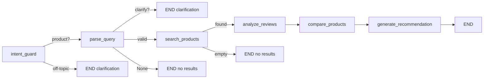
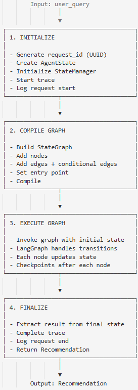
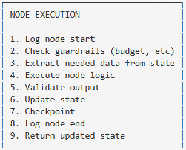
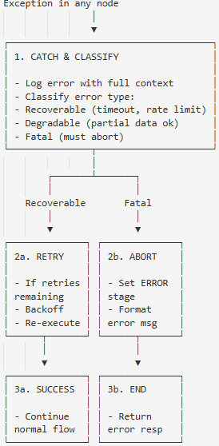
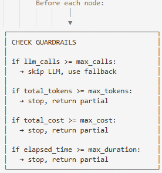

# Orchestrator

## 1. Общее описание

**Orchestrator** — центральный модуль системы, реализованный на LangGraph. Управляет выполнением всего пайплайна: определяет порядок вызова нод, обрабатывает переходы между стадиями, управляет ошибками и fallback-логикой.

### Ключевые задачи
- Определение графа выполнения (nodes + edges)
- Управление состоянием (AgentState)
- Routing между нодами на основе условий
- Обработка ошибок и recovery
- Контроль guardrails (бюджет, время, качество)

---

## 2. Интерфейс модуля

### 2.1 Основные методы

| Метод | Описание |
|-------|----------|
| `run(user_query, chat_history) → GraphState` | Запуск полного пайплайна (chat_history для multi-turn clarification) |
| `run_with_config(query, config) → Recommendation` | Запуск с кастомным конфигом |
| `get_graph() → StateGraph` | Получить граф для визуализации |
| `stream(query) → Iterator[AgentState]` | Стриминг промежуточных состояний |

### 2.2 Input/Output

**Input:**
| Поле | Тип | Описание |
|------|-----|----------|
| user_query | str | Текстовый запрос пользователя |
| config | OrchestratorConfig | Опциональные настройки |

**Output:**
| Поле | Тип | Описание |
|------|-----|----------|
| recommendation | Recommendation | Финальный результат с топ-3 |
| state | AgentState | Полное состояние для отладки |
| trace | RequestTrace | Трейс выполнения |

---

## 3. Graph Structure

### 3.1 Nodes (вершины графа)

| Node | Модуль | Описание |
|------|--------|----------|
| `intent_guard` | Orchestrator (regex) | Фильтрация off-topic запросов без LLM |
| `parse_query` | QueryAnalyzer | Парсинг запроса пользователя |
| `search_products` | ProductSearcher | Поиск и группировка товаров по маркетплейсам |
| `analyze_reviews` | ReviewAnalyzer | Анализ агрегированных отзывов |
| `compare_products` | Comparator | Сравнительный анализ ProductGroup |
| `generate_recommendation` | Recommender | Формирование рекомендации |

> **Примечание:** Ноды `handle_error` и `format_output` не существуют как отдельные вершины графа. Ошибки перехватываются в `Orchestrator.run()` и добавляются в state. Форматирование вывода реализовано в UI-слое (`app_cli.py` / `app_streamlit.py`).

### 3.2 Conditional Edges (условные переходы)

| От | Условие | К |
|----|---------|---|
| intent_guard | query has product keywords | parse_query |
| intent_guard | off-topic or no keywords | END (clarification) |
| parse_query | `needs_clarification == True` | END (clarification) |
| parse_query | `query_spec is valid` | search_products |
| parse_query | `query_spec is None` | END (no results) |
| search_products | `len(product_groups) > 0` | analyze_reviews |
| search_products | `len(product_groups) == 0` | END (no results) |
| analyze_reviews | always | compare_products |
| compare_products | always | generate_recommendation |
| generate_recommendation | always | END |

**Обновлённая схема (актуальная):**

---

## 4. Алгоритм работы

### 4.1 Main Execution Flow

### 4.2 Node Execution Pattern

Каждая нода следует единому паттерну:  
  

### 4.3 Error Recovery Flow

## 5. Guardrails

### 5.1 Budget Guardrails

Проверяются перед каждым LLM вызовом:

| Guardrail | Limit | Action on Exceed |
|-----------|-------|------------------|
| Max LLM calls | 10 | LLMBudgetExceededError |
| Max tokens | 50,000 | LLMBudgetExceededError |
| Max cost | $0.10 | LLMBudgetExceededError |
| Max duration | 90s | LLMBudgetExceededError |

### 5.2 Quality Guardrails

Проверяются после ключевых шагов:

| Checkpoint | Validation | On Failure |
|------------|------------|------------|
| After parse | category is not None | Ask clarification |
| After search | products count >= 1 | No results message |
| After recommend | products exist, prices match | Regenerate (max 2x) |

### 5.3 Guardrail Check Flow

---

## 6. Error Handling

### 6.1 Error Classification

| Error Type | Examples | Strategy |
|------------|----------|----------|
| Retryable | LLM timeout, rate limit | Retry with backoff |
| Degradable | Review analysis failed, partial search | Continue with partial data |
| Fatal | Auth error, invalid config | Abort with error message |
| Validation | Bad LLM output, hallucination | Regenerate |

### 6.2 Per-Node Error Handling

| Node | On Error |
|------|----------|
| parse_query | Retry 1x → ask clarification → abort |
| search_products | Retry per source → use mock → empty = no results |
| analyze_reviews | Skip failed products → continue with partial |
| compare_products | Use basic comparison without LLM |
| generate_recommendation | Retry 2x → basic template recommendation |

### 6.3 Error Messages (user-facing)

| Situation | Message |
|-----------|---------|
| LLM unavailable | "Сервис временно перегружен. Попробуйте позже." |
| No products found | "К сожалению, по вашему запросу ничего не найдено. Попробуйте расширить критерии." |
| Partial results | "Найдено меньше товаров, чем обычно. Показываем лучшие из доступных." |
| Timeout | "Поиск занял слишком много времени. Показываем частичные результаты." |
