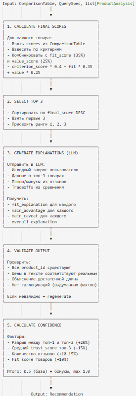

# Recommender

## 1. Общее описание

**Recommender** — финальный модуль, который формирует топ-3 рекомендации с развёрнутым объяснением выбора. Это то, что видит пользователь.

### Задачи
- Выбрать лучшие 3 товара на основе всех предыдущих этапов
- Объяснить простым языком, почему именно они
- Адаптировать объяснение под исходный запрос пользователя

---

## 2. Интерфейс модуля

### 2.1 Входные данные

| Поле | Тип | Описание |
|------|-----|----------|
| comparison | ComparisonTable | Результат сравнения товаров |
| query_spec | QuerySpec | Исходный распарсенный запрос |
| analyzed_products | list[ProductAnalysis] | Полные данные о товарах с отзывами |

> **Примечание:** `ProductAnalysis` содержит поле `product_group: ProductGroup` (не `product: Product`). `ProductGroup` объединяет предложения одной модели с разных маркетплейсов, включая `best_price`, `best_marketplace` и список `offers: list[MarketplaceOffer]`. Рекомендация работает именно с группами товаров, а не с отдельными листингами.

### 2.2 Выходные данные

**RankedProduct:**
| Поле | Тип | Описание |
|------|-----|----------|
| rank | int | Место: 1, 2 или 3 |
| product_group | ProductGroup | Данные о группе товара (объединение по маркетплейсам) |
| review_summary | ReviewSummary | Суммаризация отзывов |
| final_score | float | Итоговый балл 0-1 |
| fit_explanation | str | Почему подходит под запрос (1 предложение) |
| main_advantage | str | Главное преимущество |
| main_caveat | str | Главный недостаток/оговорка |

**Recommendation:**
| Поле | Тип | Описание |
|------|-----|----------|
| top3 | list[RankedProduct] | Три лучших товара |
| explanation | str | Общее объяснение выбора (200-400 слов) |
| confidence | float | Уверенность в рекомендации 0-1 |
| user_query | str | Исходный запрос для контекста |

## 3. Алгоритм работы

## 5. Валидация и Guardrails

| Проверка | Что проверяем | При провале |
|----------|---------------|-------------|
| Product existence | Все рекомендованные ID есть в исходном списке | Regenerate |
| Price accuracy | `_check_price_consistency()`: regex извлекает цены из текста explanation (паттерн `\d[\d\s,.]*\d\s*руб/₽`), сравнивает каждую упомянутую цену с `best_price` из `ProductGroup`. Допуск: **±5%**. Если цена неверная, но в диапазоне 50%-200% от реальной — **автозамена** в тексте. Исправления логируются. | Warning + auto-fix |
| Length check | Explanation > 100 символов | Regenerate |
| No hallucinations | Характеристики соответствуют данным | Regenerate |
| Rank correctness | Ранги 1, 2, 3 без пропусков | Fix automatically |

---

## 6. Обработка ошибок

| Ситуация | Действие |
|----------|----------|
| LLM вернул невалидный JSON | Retry с более строгим промптом (max 2) |
| LLM timeout | Сгенерировать простое объяснение по шаблону |
| Меньше 3 товаров на входе | Рекомендовать сколько есть (1-2) |
| Validation failed 2+ раз | Вернуть без detailed explanation |

---

## 7. Метрики

| Метрика | Тип | Описание |
|---------|-----|----------|
| recommendation_latency_seconds | Histogram | Время генерации |
| recommendation_confidence | Histogram | Распределение confidence |
| recommendation_regenerate_rate | Counter | % перегенераций из-за ошибок |
| recommendation_validation_failures | Counter | Количество провалов валидации |
