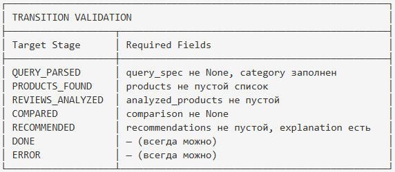

# State Manager

## 1. Общее описание

В текущей реализации **отдельный класс StateManager не существует**. Управление состоянием реализовано неявно средствами LangGraph: состояние представлено как `GraphState` (TypedDict), передаётся между нодами графа и автоматически мержится после каждого шага.

### Принципы работы
- Состояние — это `GraphState(TypedDict, total=False)`, проходящий через LangGraph-ноды
- Каждая нода возвращает `dict` с обновлёнными полями, которые мержатся в текущий state
- Валидация происходит неявно: через Pydantic-модели (QuerySpec, ProductGroup и т.д.) и routing-функции
- Трассировка выполнения находится в `RequestTrace` (модуль `observability.py`), а не в state

---

## 2. GraphState Schema

| Поле | Тип | Описание |
|------|-----|----------|
| user_query | str | Исходный запрос пользователя |
| chat_history | list[dict] | История сообщений для multi-turn clarification |
| query_spec | Optional[QuerySpec] | Распарсенный запрос |
| product_groups | list[ProductGroup] | Найденные группы товаров (объединение по маркетплейсам) |
| group_reviews | dict[str, list[Review]] | Отзывы, сгруппированные по group_id |
| analyzed_products | list[ProductAnalysis] | Товары с анализом отзывов |
| recommendation | Optional[Recommendation] | Финальная рекомендация (единственная) |
| stage | WorkflowStage | Текущая стадия |
| errors | list[str] | Накопленные ошибки |
| llm_calls | int | Количество LLM-вызовов |
| total_tokens | int | Суммарное количество токенов |
| total_cost | float | Суммарная стоимость |

> **Примечание:** Поля `request_id` и `start_time` не входят в GraphState — они хранятся в `RequestTrace` (модуль `observability.py`).

---

## 3. Механизм обновления состояния

### 3.1 Как ноды обновляют state

Каждая нода LangGraph получает текущий `GraphState` и возвращает `dict` с изменёнными полями:

```python
def parse_query(state: GraphState) -> dict:
    # ... логика парсинга ...
    return {
        "query_spec": spec,
        "stage": WorkflowStage.QUERY_PARSED,
    }
```

LangGraph автоматически мержит возвращённый dict в текущий state.

### 3.2 Валидация переходов


**Обновлённая схема (актуальная):**

Валидация переходов между стадиями реализована через conditional edges в LangGraph-графе (routing-функции в `orchestrator.py`), а не через отдельный StateManager. Каждая routing-функция проверяет текущее состояние и решает, какая нода будет следующей.

---

## 4. State Summary (для логов)

```json
{
  "stage": "REVIEWS_ANALYZED",
  "product_groups_count": 8,
  "analyzed_count": 8,
  "has_recommendation": false,
  "llm_calls": 4,
  "total_tokens": 12500,
  "total_cost": 0.018,
  "errors_count": 0,
  "chat_history_length": 1
}
```

---

## 5. Трассировка и observability

Трассировка выполнения запроса обеспечивается модулем `observability.py` через класс `RequestTrace`, который хранит:
- `request_id` — UUID запроса
- `start_time` — время начала
- Timestamps каждого шага
- Метрики (latency, tokens, cost)

`RequestTrace` существует отдельно от `GraphState` и не передаётся между нодами графа.

---

## 6. Обработка ошибок

| Ситуация | Действие |
|----------|----------|
| Ошибка в ноде | Перехватывается в `Orchestrator.run()`, добавляется в `state["errors"]` |
| Budget exceeded | `LLMBudgetExceededError`, перейти в ERROR |
| Невалидный JSON от LLM | Retry с модифицированным промптом (в LLMClient) |
