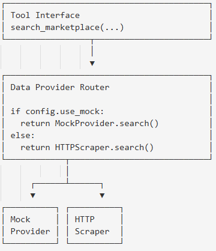

# Tools (Marketplace Integration)

## 1. Общее описание

**Tools** — модуль интеграции с внешними источниками данных (маркетплейсы). В PoC работает с mock данными, но интерфейс готов для реального парсинга.

---

## 2. Tool Registry

| Tool | Описание | Timeout | Fallback |
|------|----------|---------|----------|
| search_marketplace | Поиск товаров | 10s | mock data |
| get_product_details | Детали товара | 5s | — |
| get_reviews | Отзывы о товаре | 5s | empty list |
| get_seller_info | Информация о продавце | 5s | unknown |

---

## 3. Интерфейс Tools

### 3.1 search_marketplace

**Input:**
| Параметр | Тип | Описание |
|----------|-----|----------|
| marketplace | str | "ozon" / "wildberries" / "yandex" |
| query | str | Поисковый запрос |
| category | str | Категория (опционально) |
| max_price | int | Максимальная цена (опционально) |
| limit | int | Количество результатов (default 20) |

**Output:** `list[Product]`

### 3.2 get_reviews

**Input:**
| Параметр | Тип | Описание |
|----------|-----|----------|
| product_id | str | ID товара |
| marketplace | str | Маркетплейс |
| limit | int | Количество отзывов (default 20) |

**Output:** `list[str]` — тексты отзывов

---

## 4. Data Provider Architecture


---

## 5. Mock Data Provider

Загружает данные из JSON файлов:
data/mock/  
├── ozon_products.json  
├── wb_products.json  
└── yandex_products.json  

### 5.1 Mock файл структура
```json
{
  "categories": {
    "наушники": [
      {
        "id": "ozon_001",
        "name": "Sony WH-1000XM4",
        "price": 24990,
        "rating": 4.8,
        "review_count": 2341,
        "reviews": ["отзыв 1", "отзыв 2"],
        ...
      }
    ],
    "ноутбуки": [...],
    "телефоны": [...]
  }
}
```

### 5.2 Mock search логика
1. Найти категорию по query (точное или частичное совпадение)
2. Отфильтровать по max_price
3. Вернуть до limit товаров

## 6. HTTP Scraper (future)
Для будущей реализации реального парсинга:

Аспект|Подход
|---|---|
Rate limiting|1 req/sec per domain
User-Agent|Рандомизация
Retry|3 attempts с backoff
Blocking detection|Check for captcha/403
Fallback|Switch to mock on block

## 7. Error Handling
Ошибка|Действие|Fallback
|---|---|---|
Timeout	Retry|1x|Mock data
403 Forbidden|Не retry|Mock data
5xx Error|Retry с backoff|Mock data
Parse Error|Log + skip|Partial results
No results|Return empty|Expand search

## 8. Tool Execution Wrapper
Все tool вызовы проходят через единую обёртку:
1. Log tool call start
2. Check timeout
3. Execute with retry
4. Handle errors → fallback if needed
5. Log tool call end
6. Return ToolResult(success, data, fallback_used)
